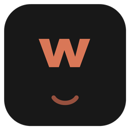
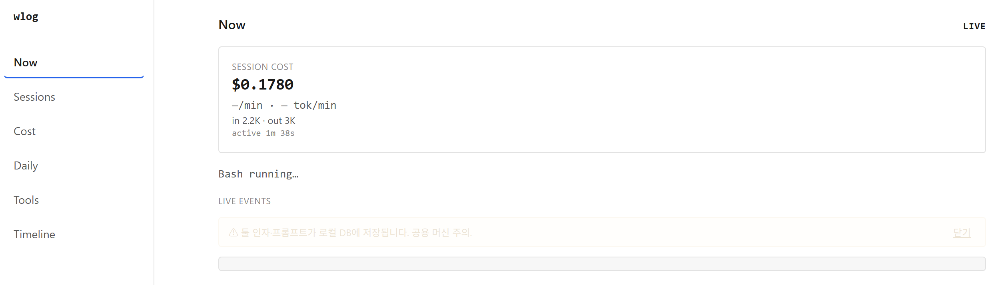

<p align="center">
  
</p>

<h1 align="center">wlog</h1>

<p align="center">
  <b>See what your Claude Code session is actually doing — tokens, cost, and tool decisions — without standing up Grafana.</b>
</p>

<p align="center">
  Single static binary · reads <code>~/.claude/projects</code> · zero-config · local-only · embedded web UI
</p>

<p align="center">
  <a href="https://github.com/openwong2kim/wlog/releases/latest"></a>
  <a href="https://github.com/openwong2kim/wlog/actions/workflows/ci.yml"></a>
  <a href="https://pkg.go.dev/github.com/openwong2kim/wlog"></a>
  <a href="LICENSE"></a>
  
</p>

---

`wlog` reads the transcript files Claude Code already writes, normalizes everything locally, and serves an embedded web UI. No Docker, no daemon, no external database, no SaaS. Run `wlog` and your past sessions — cost, tokens, and command history — are there immediately, with **zero configuration**. Turn on OpenTelemetry (OTLP) when you also want live updates and tool-decision data.

> Your Claude Code already writes its history to disk and already speaks OTel. You just need something to read it — without `docker-compose`.

<p align="center">
  
</p>
<p align="center"><i>Daily usage — a GitHub-style "잔디" heatmap of your tokens (or cost) per day.</i></p>

---

## Highlights

- 🟢 **Zero-config** — reads `~/.claude/projects` transcripts; your past sessions appear the moment you run it
- 📊 **Six screens** — Now (live), Sessions, Cost & Tokens, **Daily** usage heatmap, Tools, Timeline
- 🟩 **Daily "잔디"** — a GitHub-style contribution grid of tokens (or cost) per day
- 🔍 **Filters everywhere** — shared period (7d · 30d · 90d · 1y · All); per-model & hour/day on Cost
- 🖥️ **Desktop app** — a native Tauri app that bundles `wlog` as a sidecar: one window, no terminal
- 🔒 **Local-only** — no Docker, no SaaS, no external DB; prompt collection is opt-in
- 📡 **Optional OTLP** — add live updates and tool-decision data when you want them
- 📦 **Single static binary** — pure-Go (incl. SQLite), ~26 MB, copy-and-run

---

## Why wlog

The usual ways to look at Claude Code telemetry are heavy:

- **SaaS backends** (SigNoz Cloud, Datadog, Honeycomb) — your token, cost, and tool-decision data leaves your machine, and the onboarding/pricing is overkill for one developer.
- **Self-hosted stacks** — almost every guide is `Collector → Prometheus + Loki → Grafana`: four containers, four ports, and a "don't forget to start it every morning" footnote.

wlog sells simplicity as a feature. It is local-only, runs only when you run it, and goes from install to a live dashboard in about five minutes.

### Two data sources, one local store

| Source | Setup | What it gives you |
|---|---|---|
| **Transcript JSONL** (`~/.claude/projects/**/*.jsonl`) | None — on by default | Past sessions immediately: cost, tokens, model, cache hits, bash/MCP runs, repo & branch. Zero-config. |
| **OTLP** | One env block (opt-in) | Live updates as a session runs, plus `tool_decision` data (accept/reject and the source: config / hook / user). |

Start with **just the JSONL source** to see everything you've already done. Add **OTLP** when you want the live tail and the tool-decision drill-downs. The two sources are de-duplicated against each other, so running both never double-counts cost.

---

## Screens

Every view shares a **period filter** (`7d · 30d · 90d · 1y · All`) that scopes the whole dashboard, and the design is deliberately text- and whitespace-forward: monospace numbers, a single accent color, minimal motion, no AI-slop ornamentation.

### Now — your live session

Current session cost (max emphasis), input/output tokens, active time, the in-progress tool call, and a live event tail (SSE). Calm 2-second tick — no spinners, no count-up.

<p align="center">
  
</p>

### Daily — usage heatmap

One square per calendar day, shaded by how much you spent. Toggle between **tokens** and **cost**, scope it with the period filter, hover any day for the exact figure. Folded to your **local** calendar day (no UTC drift).

<p align="center">
  
</p>

### Cost & Tokens

Cumulative-spend step line, a `cache_hit_ratio` card with estimated savings, an input/output token series, and a per-model table. Filter by **period**, **hour/day bucket**, and **model**.

<p align="center">
  
</p>

### Sessions

One row per session: start time, cost, duration, tool accept rate, total tokens, model, and a source badge (`events` / `metrics` / `mixed`). Search by id/date, sort by time/cost/tokens, click a row to open its Timeline.

<p align="center">
  
</p>

### Tools — decisions

"Auto-approved: N" headline, accept/reject counts and reject rate, a per-source table (config / hook / user_*), and the top rejection hotspots.

<p align="center">
  
</p>

### Timeline — per-session lifecycle

A vertical lifecycle for one session: prompt → api_request → tool calls → decisions → results, with tool nodes indented under the request that triggered them. Click a node to expand it inline.

<p align="center">
  
</p>

> Screenshots use synthetic demo data (`tools/replay`), not real usage.

---

## Desktop app

`wlog` also ships as a **native desktop app** (built with [Tauri](https://tauri.app)). It bundles the `wlog` binary as a sidecar: launching the app starts the local server and opens the UI in one window, and closing the window shuts the server down cleanly — no orphaned processes, no terminal needed.

```bash
cd desktop
npm install
npm run build      # produces an installer under src-tauri/target/release/bundle/
```

The installer (`.msi` / `-setup.exe` on Windows) is a normal per-user install. Requirements: a Rust toolchain, and on Windows the WebView2 runtime (preinstalled on Windows 11). The desktop app reads the same local store as the CLI, so your past sessions show up the moment it opens.

---

## Install

### go install

```bash
go install github.com/openwong2kim/wlog/cmd/wlog@latest
```

### GitHub Releases

Download a prebuilt static binary for your OS/arch from the
[Releases page](https://github.com/openwong2kim/wlog/releases), unpack it, and put
`wlog` on your `PATH`. Builds are published for linux, macOS, and Windows on
amd64 and arm64, with checksums and an SBOM.

> A Homebrew tap and Scoop bucket are planned.

---

## Start in 5 minutes

### Stage 1 — zero-config: see your past sessions now

```bash
wlog
```

wlog scans `~/.claude/projects` for the transcript files Claude Code already wrote, the web UI starts, and the browser opens. If you've used Claude Code before, **your past sessions are already there** — no env vars, no restart. The startup line tells you the ports:

```
wlog v0.1.0  otlp=grpc://127.0.0.1:4317,http://127.0.0.1:4318  ui=http://127.0.0.1:7890
```

Cost, tokens, models, cache-hit ratios, and bash/MCP command history are populated from the transcripts on disk.

> Prefer the terminal? `wlog last` prints a one-shot summary of your most recent session without opening anything — see [`wlog last`](#wlog-last).

### Stage 2 — optional: add live updates + tool decisions

The transcript files don't include Claude Code's permission decisions (accept/reject and the source), and they're only written as a session progresses. Turn on OTLP to get **live updates** and the **tool-decision** data that powers the Tools screen.

The fastest way is one command — it merges the OTel env block, the status line, and a SessionEnd summary hook into `~/.claude/settings.json` (preserving your other settings, with a `.bak` backup):

```bash
wlog setup              # then restart Claude Code
wlog setup --status     # verify it took effect (read-only)
wlog setup --uninstall  # undo anytime
```

Prefer to do it by hand? `wlog --print-claude-setup` prints the exact JSON `env` block (and a bash form) to paste into `~/.claude/settings.json`.

Then run Claude Code, make a request, and switch back to the **Now** tab — the first `api_request` reaches wlog within a few seconds.

> Want prompt text and detailed tool arguments too? Those are opt-in on the Claude Code side (`OTEL_LOG_USER_PROMPTS=1`). See [Privacy](#privacy) before enabling — they get stored in your local DB.

> **Tip:** keep a live status line in Claude Code itself with [`wlog statusline`](#wlog-statusline), so you see your running cost without switching to the browser.

---

## CLI

```
wlog                              run the receiver + UI, auto-open the browser
wlog last [--session id] [--n N]  print a one-shot summary of the latest session
wlog statusline [--install]       emit one status line for Claude Code's status bar
wlog setup [--status|--uninstall] auto-configure Claude Code (OTel + statusline + hook)
wlog tail [--session id]          stream live events to the terminal (no UI)
wlog export --session <id> [...]  export a session to a file or stdout
wlog version                      print version information
wlog --print-claude-setup         print the Claude Code OTel env snippet and exit
```

### Flags

| Flag | Default | Description |
|---|---|---|
| `--otlp-grpc-port` | `4317` | OTLP/gRPC listener port. |
| `--otlp-http-port` | `4318` | OTLP/HTTP listener port. |
| `--ui-port` | `0` (auto) | Web UI port; `0` picks a free port automatically. |
| `--listen` | `127.0.0.1` | Bind address. |
| `--unsafe` | `false` | Allow a non-loopback bind without auth. |
| `--auth-token` | _(none)_ | Auth token required for non-loopback access. |
| `--db` | platform data dir | SQLite database path. |
| `--memory` | `false` | Use an in-memory database (nothing persisted). |
| `--retention` | `90d` | Data retention window (e.g. `90d`, `72h`). |
| `--max-sessions` | `1000` | Max retained sessions (oldest pruned first). |
| `--max-recv-bytes` | `16MB` | Max size of a single OTLP message. |
| `--no-open` | `false` | Do not auto-open the browser. |
| `--no-store-prompts` | `false` | Do not persist prompts / tool arguments. |
| `--no-jsonl` | `false` | Disable zero-config Claude Code transcript (JSONL) ingestion. |
| `--claude-dir` | `~/.claude/projects` | Directory of Claude Code transcripts to scan. |
| `--print-claude-setup` | `false` | Print the Claude Code OTel env snippet and exit. |

Every flag has a `WLOG_*` environment-variable equivalent (e.g. `WLOG_OTLP_GRPC_PORT`, `WLOG_UI_PORT`, `WLOG_LISTEN`, `WLOG_DB`, `WLOG_RETENTION`, `WLOG_NO_STORE_PROMPTS`, `WLOG_NO_JSONL`, `WLOG_CLAUDE_DIR`). Explicit flags always win over the environment.

### `wlog last`

Print a one-shot summary of your latest session — cost, tokens, tool accept/reject counts, and recent command history — and exit. It is read-only: it does **not** start the receiver or the web UI, so it works whether or not a `wlog` server is running.

```bash
wlog last                      # summarize the latest session
wlog last --session 0a1b2c3d   # summarize a specific session
wlog last --n 20               # list the last 20 commands (default: 10)
```

```
session 0a1b2c3d  18:42–19:05 (23m)  cost=$0.42  in=128.4K out=12.1K  cache_hit=71%
tools  accept 34  reject 2  auto-approved 28
  ✕ reject  Bash (source=user_reject)
bash (last 10)
  18:43:07  ok   npm ci
  19:02:54  fail go build ./cmd/wlog
```

### `wlog statusline`

Show your current session's cost, tokens, cache-hit ratio, rejections, and the running tool directly in Claude Code's status bar:

```
$0.42 · in 128.4K/out 12.1K · cache 71% · ⊘2 reject · Bash
```

Install it (idempotent; backs up `settings.json` first):

```bash
wlog statusline --install
```

It reads the store directly and needs **no running `wlog` server** — it works from the zero-config transcript data alone, and never fails the status bar (blank line + exit 0 on any error).

---

## Privacy

wlog is **local-only**. Data never leaves your machine, and it makes no outbound connections.

- **Prompts and tool arguments are not collected by default.** They reach wlog only if you opt in on the Claude Code side (`OTEL_LOG_USER_PROMPTS=1`). wlog stores only what it receives.
- **`--no-store-prompts`** drops prompt/argument payloads even when Claude Code sends them.
- The UI shows a **three-stage privacy banner**: detailed-logging-off (default), a one-time amber warning when logging is on, and a persistent red banner on a non-loopback bind.
- The database file is created with `0600` permissions, and non-loopback binds require `--unsafe` or `--auth-token` (with a Host-header check to block DNS rebinding).

---

## How it works

```
Claude Code ──OTLP gRPC :4317 / HTTP :4318──▶  receiver  ─┐
                                                          │
~/.claude/projects/**/*.jsonl ──scan + watch──▶ jsonl.Parse ─┤   wlog (single process)
                                                          │
                       otel.Parse ──▶ delta normalization ─┤
                                                          ▼
        single-writer (dedup) ──▶ SQLite (WAL) + series_state ──▶ live bus (SSE)
                                                          │
              embedded web UI (go:embed) ──▶ http://127.0.0.1:<auto>
```

**Two ingest paths, one store.** On startup wlog scans `~/.claude/projects` for Claude Code's transcript JSONL and watches for new lines; in parallel OTLP arrives over gRPC/HTTP (all three signals) through a bounded, backpressuring queue, and counters are normalized from cumulative/delta temporality into per-interval deltas. When the same `api_request` arrives from both sources, a shared de-duplication key collapses it to one row, so cost is never double-counted. A single writer goroutine serializes all SQLite writes; reads use a separate WAL pool. The UI is compiled into the binary via `go:embed`.

**Where your data lives:**

| Platform | Default database path |
|---|---|
| Windows | `%LOCALAPPDATA%\wlog\wlog.db` |
| macOS | `~/Library/Application Support/wlog/wlog.db` |
| Linux / other | `${XDG_DATA_HOME:-~/.local/share}/wlog/wlog.db` |

Override with `--db PATH`, or use `--memory` to keep everything in RAM.

---

## Build from source

Requirements: Go 1.26+, Node 22+, and always `CGO_ENABLED=0` (the SQLite driver is pure Go).

```bash
# 1. Build the embedded UI
cd ui && npm ci && npm run build      # outputs into ../internal/web/dist

# 2. Build the static binary (from the repo root)
cd .. && CGO_ENABLED=0 go build \
  -ldflags "-s -w -X github.com/openwong2kim/wlog/internal/version.Version=0.1.0" \
  -o wlog ./cmd/wlog
```

The result is a single static binary (~26 MB) with the UI embedded — copy it anywhere and run it. A `Taskfile.yml` is included (`task build`, `task run`, `task test`, `task cross`).

To regenerate the demo screenshots: run a demo instance (`wlog --db demo.db --no-jsonl --ui-port 8898 --otlp-grpc-port 14317 --otlp-http-port 14318`), inject synthetic data (`replay --endpoint grpc://127.0.0.1:14317 --spread-days 70`), then capture each route.

---

## License

[MIT](LICENSE) © 2026 openwong2kim
