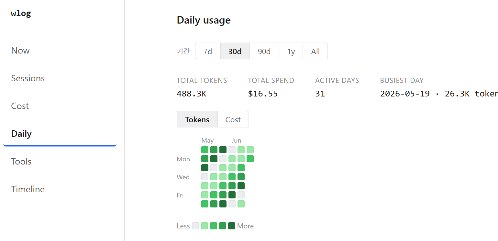
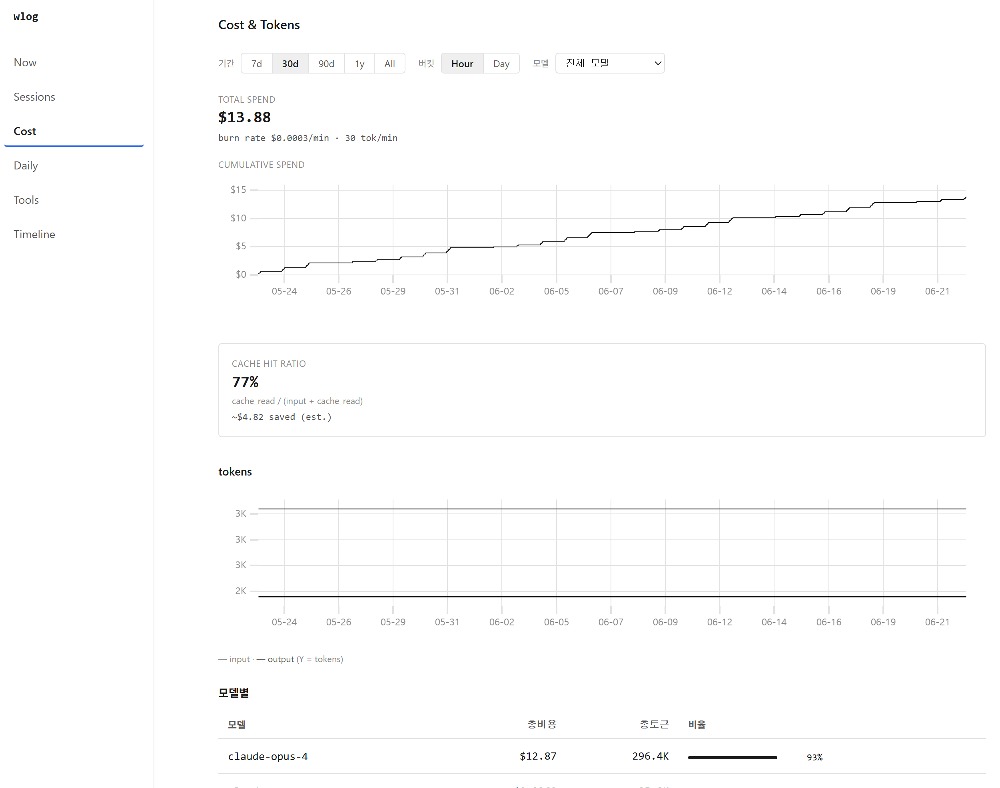
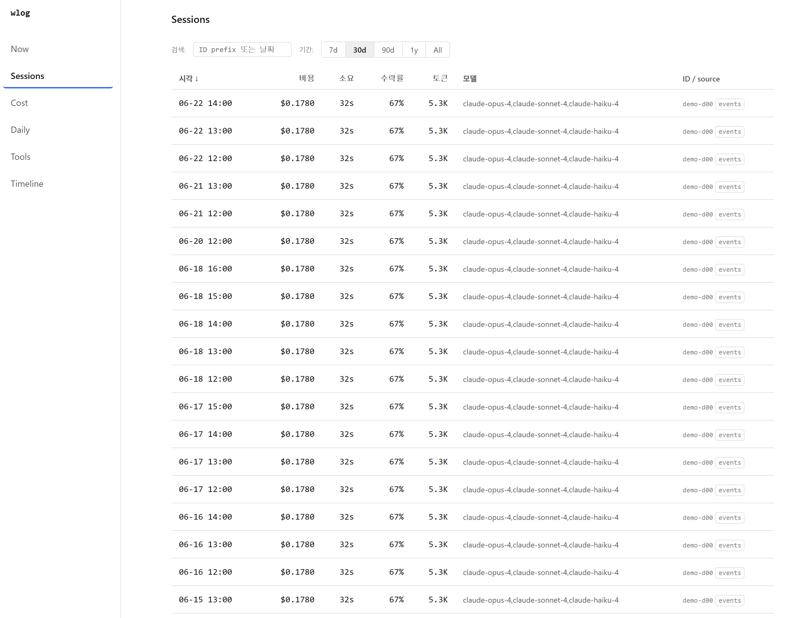
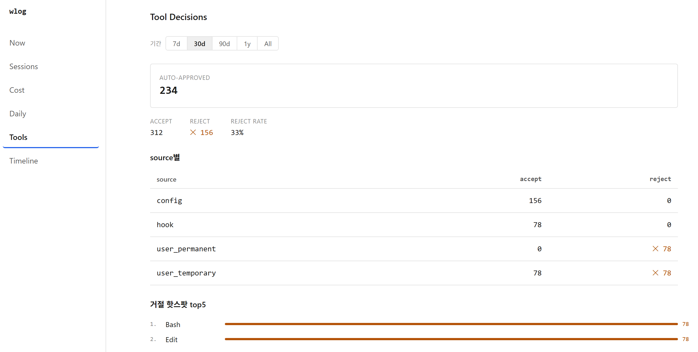
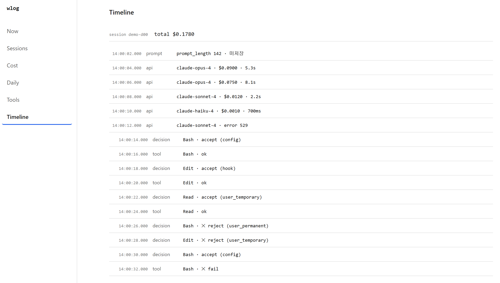

**wlog** reads the transcript files Claude Code already writes to `~/.claude/projects`,
normalizes everything locally, and serves an embedded web UI. No Docker, no daemon,
no external database, no SaaS — run it and your past sessions (cost, tokens, command
history) are there immediately, with zero configuration. Turn on OpenTelemetry (OTLP)
when you also want live updates and tool-decision data.

[⬇ Download the latest release](https://github.com/openwong2kim/wlog/releases/latest) ·
[View on GitHub](https://github.com/openwong2kim/wlog)



## Highlights

- **Zero-config** — reads your transcripts; past sessions appear the moment you run it
- **Six screens** — Now (live), Sessions, Cost & Tokens, Daily usage heatmap, Tools, Timeline
- **Daily "잔디"** — a GitHub-style contribution grid of tokens (or cost) per day
- **Filters everywhere** — shared period (7d · 30d · 90d · 1y · All); per-model & hour/day on Cost
- **Desktop app** — a native Tauri app that bundles wlog as a sidecar: one window, no terminal
- **Local-only** — no Docker, no SaaS, no external DB; prompt collection is opt-in

## Install

```bash
go install github.com/openwong2kim/wlog/cmd/wlog@latest
```

Or download a prebuilt archive (linux / macOS / windows · amd64 / arm64) from the
[releases page](https://github.com/openwong2kim/wlog/releases) and verify it against
`checksums.txt`.

## Screens

### Cost & Tokens


### Sessions


### Tools


### Timeline


---

Full documentation, CLI reference, and privacy notes are in the
[README](https://github.com/openwong2kim/wlog#readme). MIT licensed.
